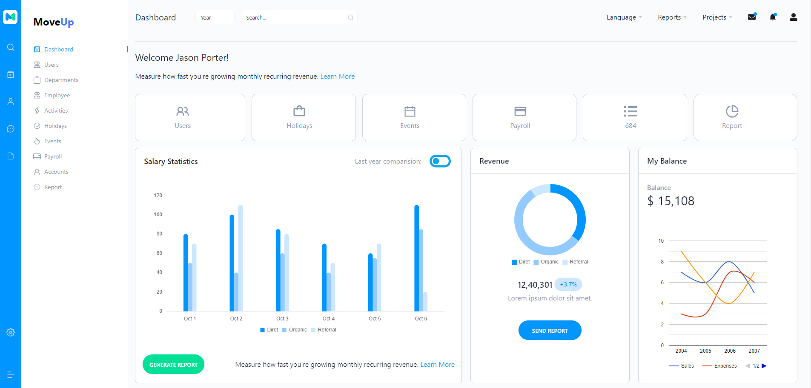

  <h1>Comprehensive Project README Template</h1>

## 

# Project Name

### MoveUp HRM (Human Resource Management) Project [Front End]

## Introduction

The HRM (Human Resource Management) project is a comprehensive web application designed to streamline and enhance the management of human resources within an organization. This project aims to provide a user-friendly platform that enables HR professionals to efficiently manage employee information, track attendance, handle payroll, and facilitate various HR-related tasks.

## Key Features

- <b>Employee Management:</b> Maintain detailed records of employee information, including personal details, job roles, and performance evaluations.

- <b>Reports and Analytics:</b> Generate insightful reports and analytics to assist in strategic HR decision-making.

- <b>Payroll Management:</b> Simplify payroll processing with automated calculations for salaries, deductions, and benefits.

- <b>Performance Appraisal:</b> Conduct performance evaluations and provide feedback to employees for their professional development.

- <b>Events Management:</b> Organize and manage company events, meetings, and training sessions.

- <b>Holiday Management:</b> Keep track of public holidays and company-specific holidays, and manage holiday requests.

## Technology Stack

- Example: React, Redux, Rechart, Tailwind CSS, Daisy UI etc.

## Live URL

URL: https://moveup-hrm-front-end.vercel.app/
